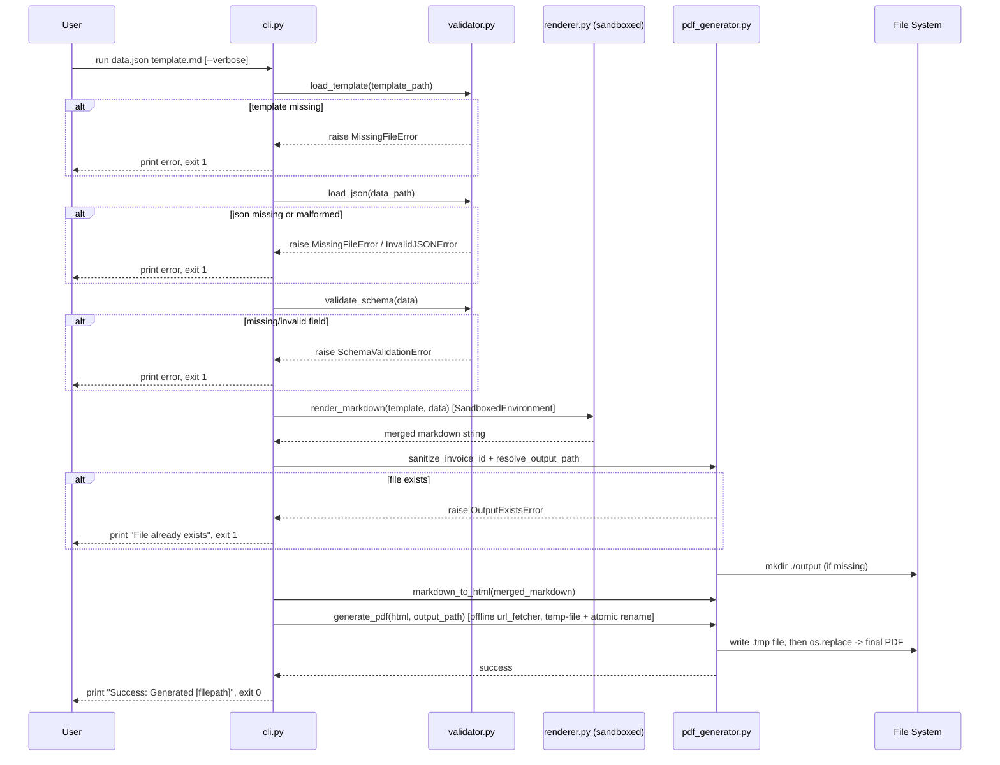
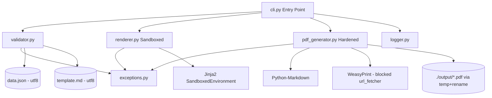

# System Architecture: Automated Billing CLI (v2 - Post Design Review)

## 1. Overview

A modular, offline-first Python CLI application following a linear pipeline architecture: **Parse -> Validate -> Merge -> Render -> Persist**. Each stage is a discrete, testable component to support TDD in Phase 5 and clean separation of concerns. This version incorporates hardening changes from `design-review.md`.

## 2. Technology Choices & Justification

| Layer | Technology | Justification |
|---|---|---|
| CLI Parsing | `argparse` (stdlib) | Zero external dependency; sufficient for 2 positional args + 1 flag; built-in help/usage generation |
| JSON Parsing | `json` (stdlib) | Native, raises `json.JSONDecodeError` cleanly for malformed JSON detection |
| Schema Validation | Custom validator module | Only 5 fields with simple types; a full schema library is over-engineering for this scope; custom code gives full control over distinct error messages |
| Templating | `Jinja2` (`sandbox.SandboxedEnvironment`) | Explicitly required; sandboxed environment prevents SSTI by restricting attribute/introspection access |
| Markdown -> HTML | `markdown` (Python-Markdown) | Lightweight library to convert merged Markdown (incl. tables via `tables` extension) into HTML |
| HTML -> PDF | `WeasyPrint` (with locked-down `url_fetcher`) | Pure-Python/CSS PDF rendering, fully offline; custom fetcher blocks all remote/local resource resolution to guarantee offline NFR |
| Packaging | `pyproject.toml` + `pip` | Standard modern Python packaging |

## 3. Component Responsibilities

### 3.1 `cli.py` (Entry Point)
- Parses CLI arguments (`data.json` path, `template.md` path, `--verbose` flag) via `argparse`.
- Orchestrates the pipeline: Validator -> Renderer -> PDFGenerator.
- Catches all custom exceptions at the top level, prints the associated human-readable message, exits code `1`. On success, prints `Success: Generated [filepath]`, exits `0`.

### 3.2 `validator.py`
- `load_json(path)`: confirms file exists, reads with `encoding="utf-8"` explicitly, parses JSON (raises `InvalidJSONError` on syntax errors).
- `validate_schema(data)`: checks presence and types of required fields; raises `SchemaValidationError` naming the specific field.
- `load_template(path)`: confirms template file exists, reads with `encoding="utf-8"` explicitly; raises `MissingFileError` if missing.

### 3.3 `renderer.py` (HARDENED)
- Uses `jinja2.sandbox.SandboxedEnvironment` (NOT the default `Environment`/`Template`) to load and render the template string, mitigating Server-Side Template Injection (SSTI) risk per design-review SEC-1.
- `render_markdown(template_str, data)`: `SandboxedEnvironment().from_string(template_str).render(**data)`.

### 3.4 `pdf_generator.py` (HARDENED)
- `sanitize_invoice_id(invoice_id)`: strips/rejects any character outside `[A-Za-z0-9_-]` before it is used in a filesystem path, preventing path traversal (design-review SEC-3).
- `resolve_output_path(invoice_id)`: builds `./output/invoice_<sanitized_id>.pdf`; creates `./output/` via `os.makedirs(exist_ok=True)`; raises `OutputExistsError` if the target PDF already exists.
- `markdown_to_html(md_str)`: converts Markdown (with `tables` extension) to an HTML fragment wrapped in a minimal HTML document with inline `<style>` for A4 size and basic table borders.
- `generate_pdf(html_str, output_path)`: configures `WeasyPrint.HTML(string=html_str, url_fetcher=blocking_fetcher)` where `blocking_fetcher` rejects all `http(s)://` and `file://` resource resolution, enforcing the offline NFR (design-review SEC-2). Writes to a temp file (`<output_path>.tmp`) first, then atomically `os.replace()`s it to `output_path` only after a fully successful write; on any exception, the temp file is deleted (design-review REL-1).

### 3.5 `exceptions.py`
- Custom exception hierarchy: `BillingCLIError` (base) -> `MissingFileError`, `InvalidJSONError`, `SchemaValidationError`, `OutputExistsError`. Each carries a pre-formatted human-readable message consumed by `cli.py`.

### 3.6 `logger.py`
- Thin wrapper around stdlib `logging` configured for console-only output; toggles DEBUG-level output when `--verbose` is set.

## 4. Data Flow (Sequence Diagram)

## 5. Module/Component Diagram

## 6. Error Code & Exit Strategy

| Scenario | Exception | Console Message Pattern | Exit Code |
|---|---|---|---|
| `data.json` or `template.md` not found | `MissingFileError` | `Error: File not found - <path>` | 1 |
| Malformed JSON syntax | `InvalidJSONError` | `Error: Invalid JSON in <path> - <detail>` | 1 |
| Missing/invalid required field | `SchemaValidationError` | `Error: Invalid data - field '<field>' <reason>` | 1 |
| Output PDF already exists | `OutputExistsError` | `Error: File already exists - <path>` | 1 |
| Successful generation | N/A | `Success: Generated <filepath>` | 0 |

## 7. Assumptions & Accepted Risks (Updated Post Design Review)

- **Trusted-but-sandboxed templates:** Templates are treated as user-authored, but rendering still uses `SandboxedEnvironment` as defense-in-depth (not solely relying on a trust assumption).
- **Offline guarantee:** WeasyPrint's `url_fetcher` is explicitly overridden to block all remote/local resource fetching; no network or file-system access occurs during PDF rendering beyond the final write.
- **TOCTOU race (accepted risk):** A small window exists between the output-file existence check and the atomic write. Given this is a single-user local CLI with no concurrent invocations expected, this is an accepted risk, not a blocking defect.
- **In-memory processing (accepted risk):** `line_items` arrays are processed fully in memory with no streaming/pagination. Acceptable for realistic single-invoice payload sizes; not designed for bulk/batch invoice generation.
- **Unrestricted CLI file paths (accepted risk):** The CLI accepts any file system path for input files, consistent with standard CLI tool conventions; this is a local single-user tool with no elevated trust boundary to enforce.
- **UTF-8 enforced:** All file reads/writes explicitly use `encoding="utf-8"` to avoid locale-dependent decode errors.
- **WeasyPrint system dependencies:** Pango/Cairo system libraries are assumed installable in the target environment; documented in `README.md` setup section during implementation.
